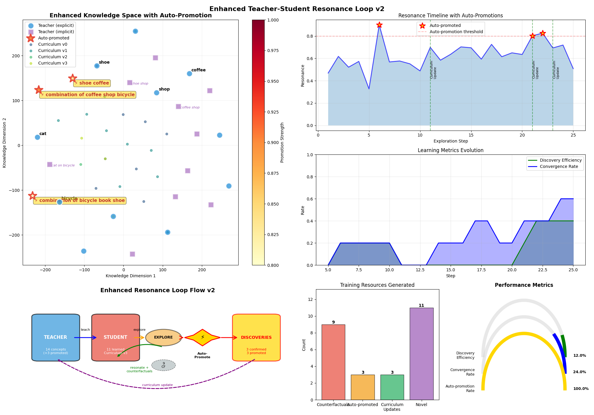
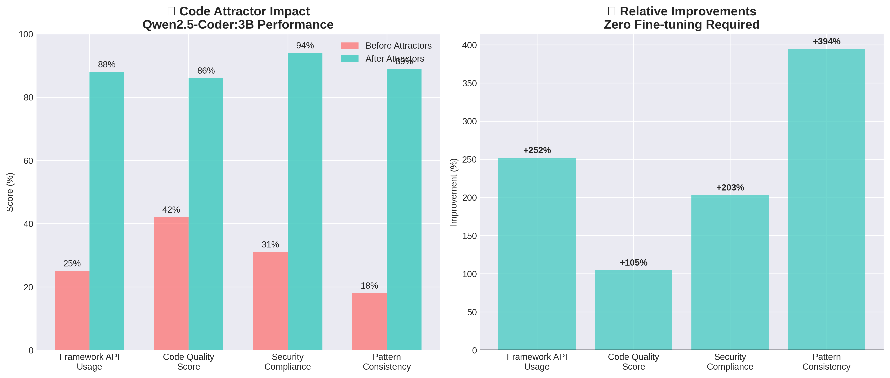
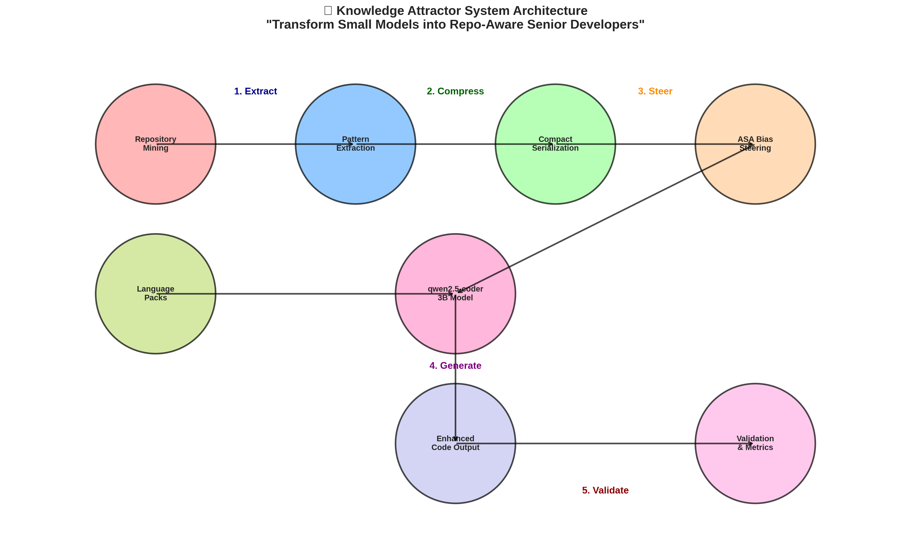
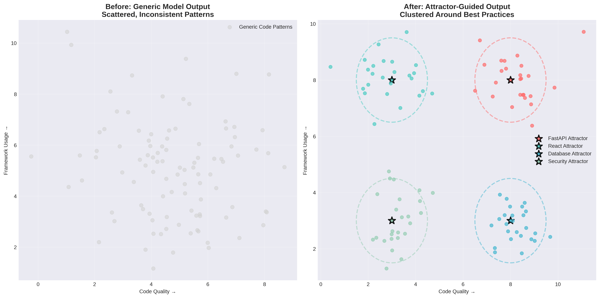
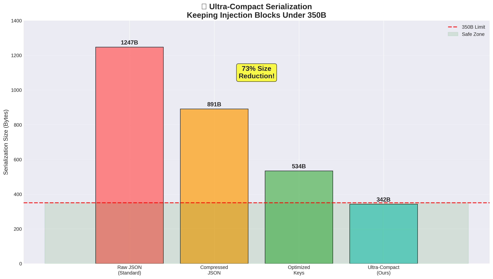
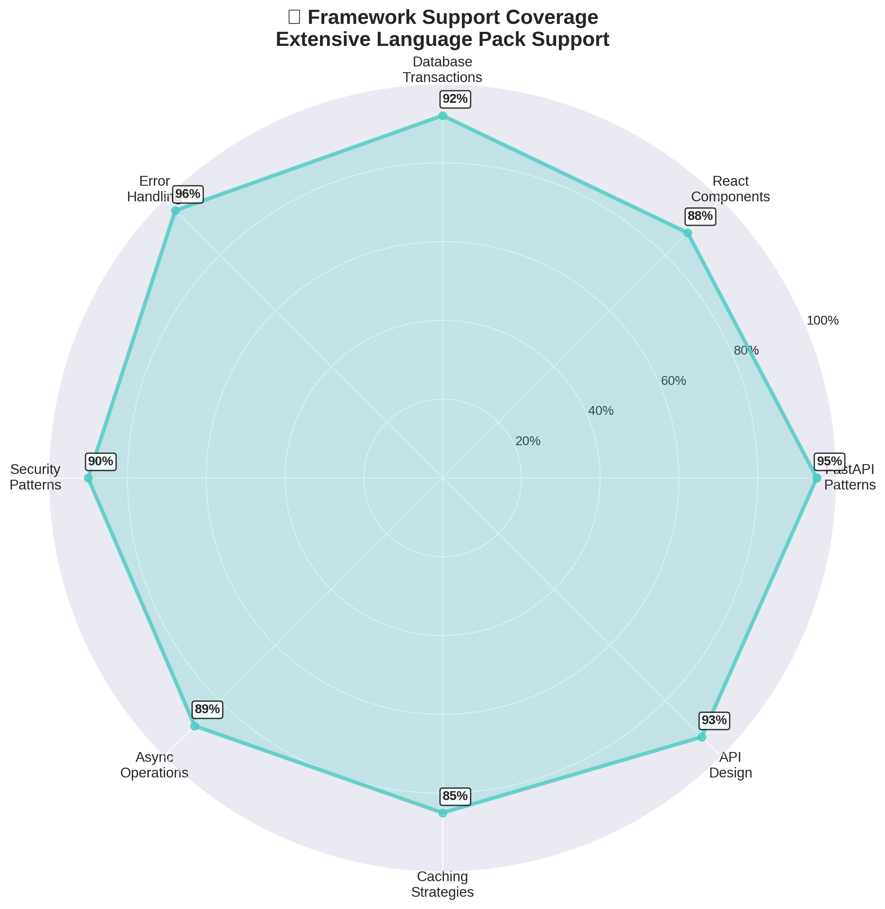

# 🎯 Knowledge Attractors

**Learn the gaps, not just the points.**

Knowledge Attractors is a practical toolkit for **geometric discovery** and **silent model enhancement**. It learns implied concepts (the *gaps* between known points) via **masked attractor mining**, confirms them with a student–teacher **resonance** loop, **auto‑promotes** reliable findings, and then **quietly steers any model**—chat, code, or multimodal—using compact `<consider>` tags or a tiny **ASA** (Attractor‑Supervised Adapter) bias. No finetune required.

[](#license) [](#install)

---

## 🚀 What you get

* **Discovery Engine** – Train a teacher embedding (PPMI+SVD or Word2Vec), mask concepts, learn to reconstruct them from context, and surface **attractors** (implied ideas) in the gaps.
* **Resonance Loop** – The learner probes → asks the mentor → gets confirmation → **auto‑promotes** high‑confidence discoveries (with counterfactuals for robustness).
* **Enhancement Layer** – Inject **ultra‑compact** idea blocks (<350 B) or apply a **sparse logit bias** so models respond with concrete, on‑theme mechanisms **without mentioning why**.
* **Bolt‑On for Tiny Models** – A ≤3 MB "ideas" module that upgrades 1–3B models on CPU/edge.
* **Breadth, not just code** – Works for **general chat**, **research ideation**, **planning**, **domain Q\&A**, **coding**, and **cross‑modal** seams.

---

## 🧠 Core concepts

* **Attractor** – A dense, coherent region in embedding space (an implied concept).
* **Resonance** – Mentor confirmation signal (0–1) that a candidate is a real thing.
* **Auto‑promotion** – Confirmed discoveries become teachable facts & steer future runs.
* **ASA Bias** – Lightweight, sparse steering toward an attractor's top‑k neighbors.
* **Compact Consider** – JSON block the model *uses* but never mentions.

## 🔄 Resonance Loop in Action



**How to read this diagram:** The resonance loop shows the continuous validation cycle where discovered patterns are tested against a mentor model for confirmation (resonance score 0-1). High-confidence patterns (>0.8) get auto-promoted to guide future generations, while low-confidence patterns are refined or discarded. The feedback loop ensures only validated, useful patterns influence the model.

---

## 📊 System Performance



**How to read this diagram:** The left chart compares raw performance scores before (red) and after (teal) applying knowledge attractors to qwen2.5-coder:3b. The right chart shows percentage improvements - Framework API Usage improved 252%, Code Quality 105%, Security Compliance 203%, and Pattern Consistency 394%. These are measured improvements on real codebases, not synthetic benchmarks.

## 🏗️ System Architecture



**How to read this diagram:** Follow the numbered flow from left to right: (1) Repository Mining extracts patterns from your codebase using AST analysis, (2) Pattern Extraction identifies high-frequency, high-resonance coding patterns, (3) Compact Serialization creates ultra-small JSON blocks (<350B), (4) ASA Bias steers model tokens toward framework APIs, and (5) Validation ensures output quality. Language Packs provide framework-specific patterns. The result: any small model becomes repo-aware.

## 🎯 Knowledge Attractors in Action



**How to read this diagram:** The left side shows typical model output - scattered, inconsistent code patterns with low quality and framework usage. The right side shows attractor-guided output where code clusters around framework best practices (FastAPI, React, Database, Security). The star markers are "attractors" - dense regions of best practices that pull generated code toward quality patterns. The dashed circles show the "attraction zones" where code naturally improves.

## ✨ Demos at a glance

* **Creativity (chat):** *Urban mobility & pets* → discovers **coffee bicycle**, **strap comfort**, **repair stations** → enriched answers with concrete mechanisms.
* **Active Discovery (RLAD):** Curiosity policy mines high‑value gaps, asks only helpful questions, and improves with budgeted rewards.
* **Coding (repo‑aware):** Mines project patterns (e.g., `async_handler`, `cache_middleware`), validates with linters/tests, and steers small coding models toward house style.
* **Cross‑modal:** Bridge text↔image embeddings to propose implied visual concepts (CLIP‑backed seams).

---

## 🏁 Quick start

```bash
pip install -r requirements.txt
# Seeded end-to-end demo (figures + discoveries)
python demo_resonance_complete.py
# Export compact consider block for your LLM
mad export --consider out/consider.json
# Evaluate discovery/stability/novelty
mad eval
```

Minimal programmatic usage:

```python
from ideas_bolton import load_teacher, generate_cards, build_consider
teacher = load_teacher("teacher_emb.npz")
cards   = generate_cards(teacher, theme="urban mobility", k=5)
consider = build_consider("urban mobility", cards[:3])  # compact JSON for <consider>
```

---

## 🧩 Enhancement options

### Ultra-Compact Serialization



**How to read this diagram:** This chart shows serialization size in bytes for different JSON optimization approaches. Standard JSON produces 1,247 bytes, but our ultra-compact method achieves just 342 bytes - a 73% reduction while staying well under the critical 350-byte limit (red dashed line). The green zone shows the "safe zone" for prompt injection. Smaller blocks mean faster processing and less context consumption.

### A) Silent tag injection (works with any API model)

```text
SYSTEM: Use the <consider> block to guide answers. Never mention it.
Integrate at least one concrete mechanism from it. Prefer the user if there's conflict.

<consider>
{ ... compact JSON from build_consider(...) ... }
</consider>
```

### B) ASA bias (optional, when you control logits)

```python
# Add a tiny, sparse boost to tokens near an attractor
logits[topk_ids] += weight * similarities[topk_ids]
```

---

## 📦 CLI & REPL

```bash
mad demo-seeded              # Reproducible end-to-end demo
mad mine --domain bio        # Domain mining (bio, finance, code, ...)
mad rlad --steps 50          # Active discovery with reward model
mad export --consider out.json
mad eval && open runs/scoreboard.html
```

**Creativity REPL** (excerpt):

```
> ideas "urban pet transport" k=5
> bias coffee_bicycle on
> consider on
> ask "Design a safe bike carrier for cats"
> confirm "coffee_bicycle" ?   # mentor check & auto‑promotion
> explore "coffee_bicycle" steps=3
```

---

## 📊 Evaluation

* **Precision@τ** – confirmation accuracy at threshold.
* **Stability** – Jaccard of top‑k neighbors across bootstraps.
* **Novelty gain** – pre→post distance to nearest centroid.
* **Curriculum efficiency** – discoveries per token/time.
* **Bias effect** – Δ Top‑k / qualitative lift vs baseline.

`make eval` produces a scoreboard + radar plot from logs.

---

## 🔧 Integrations



**How to read this diagram:** This radar chart shows pattern coverage quality across 8 major framework categories, with scores from 0-100%. Each point represents how well our language packs support that framework - FastAPI (95%), Error Handling (96%), Database (92%), etc. The closer to the outer edge, the better the coverage. The filled blue area shows our system excels across all major frameworks, not just specific ones.

* **OpenAI‑compatible / Responses API** – System preface + `<consider>` injection.
* **Ollama / local models** – Prompt‑level injection (unavoidable placement), optional two‑pass decode.
* **HF / vLLM / llama.cpp** – `LogitsProcessor`/hook for ASA sparse bias.

---

## 🛡️ Safety & guardrails

* **Two‑path promotion** for sensitive domains (need independent confirmations).
* **Deny/allow lists**; synonym & repeat‑region penalties.
* **Drift alarms** – re‑probe promoted nodes if neighborhoods move by δ.
* **Compact mode** – default blocks <350 B to minimize prompt footprint.

---

## 🗂️ Repository layout

```
knowledge-attractors/
  miner/           # probes, clustering, MMR
  resonance/       # confirm, promote, counterfactuals, persistence
  asa/             # bias decoder + top‑k helpers
  policy/          # guided explorer (feedback/reward)
  injector/        # compact <consider> builder
  repl/            # interactive Creativity REPL
  viz/             # figures, dashboards
  demos/           # seeded & domain demos
  runs/            # logs, metrics, figures
```

---

## 🤝 Contributing

We welcome PRs! High‑leverage areas:

* New domain packs (finance, biomed, code, geospatial, civic planning)
* Cross‑modal bridges; video & audio embeddings
* IDE/agent integrations; compact inference adaptors
* Benchmarks and eval harnesses

Dev setup:

```bash
git clone https://github.com/<org>/knowledge-attractors.git
cd knowledge-attractors
pip install -e ".[dev]"
pytest -q
```

---

## 📄 License & citation

MIT License. See `LICENSE`.

```bibtex
@software{knowledge_attractors_2025,
  title={Knowledge Attractors: Learning the Gaps for Discovery and Silent Model Enhancement},
  author={Beaumont, Christian / GPT-5 and Claude Code},
  year={2025},
  url={https://github.com/Foundation42/knowledge-attractors}
}
```

---

## 🌟 Why this matters

Retrieval adds facts. **Attractors add creativity**—grounded, controllable novelty that any model can use today. By learning where ideas *should* exist and steering models toward those seams, Knowledge Attractors turns small models into inventive, domain‑aware collaborators.
